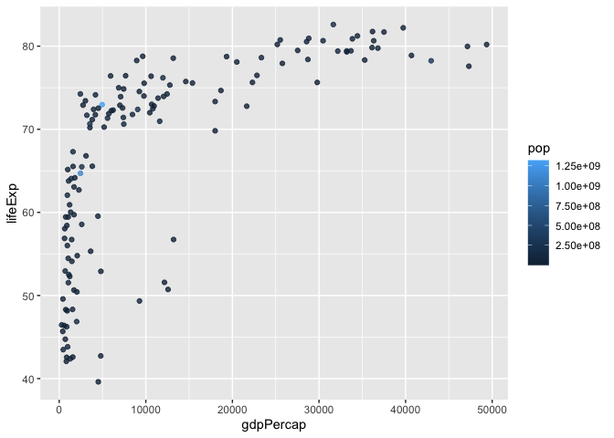
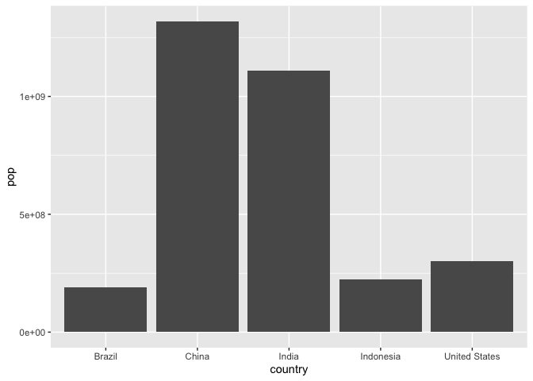

# Class 5: Data Visualization with ggplot
Assael (PID: A10179083)

## Using GGplot2

To use ggplot2 we need to first install it, to do this we will use the
function `install.packages()`

Before we use it, we need to load the package with `library(ggplot2)`,
but if we just try using ggplot we see an empty frame because we haven’t
told it the other 2 things it needs…

``` r
library(ggplot2)
ggplot(cars)
```


``` r
head(cars)
```

      speed dist
    1     4    2
    2     4   10
    3     7    4
    4     7   22
    5     8   16
    6     9   10

``` r
plot(cars)
```


To use ggplot i need at least 3 things: - data (always in a
data.frame) - aesthetics (aes() values - how the data maps to the plot)
-geometries

``` r
ggplot(cars) +
  aes(x=speed, y=dist) +
  geom_point()+
  geom_smooth(method="lm", se=FALSE) +
  theme_bw()
```

    `geom_smooth()` using formula = 'y ~ x'


``` r
#or
#ggplot(cars, aes(x=speed, y=dist), geom_point)
#but this way is harder to troubleshoot so stick with the first way
```

Here I am inspecting the data for the number of rows and columns, and to
get an overview of the genes

``` r
url <- "https://bioboot.github.io/bimm143_S20/class-material/up_down_expression.txt"
genes <- read.delim(url)
#head(genes)
#tail(genes)
nrow(genes)
```

    [1] 5196

``` r
ncol(genes)
```

    [1] 4

``` r
colnames(genes)
```

    [1] "Gene"       "Condition1" "Condition2" "State"     

``` r
table(genes[,"State"])
```


          down unchanging         up 
            72       4997        127 

``` r
round( table(genes$State)/nrow(genes) * 100, 2 )
```


          down unchanging         up 
          1.39      96.17       2.44 

There are 127 upregulated genes

here i am plotting genes with ggplot

``` r
ggplot(genes)+
  aes(x=Condition1, y=Condition2)+
  geom_point()
```

``` r
p <-ggplot(genes)+
  aes(x=Condition1, y=Condition2, col=State)+
  geom_point()
p
```


``` r
p +scale_colour_manual( values=c("blue","gray","red") ) +
  labs(title = "Gene expression changes upon drug treatment", x ='Control(no drug)', y='Drug Treatment')
```


\##Going Further

This portion of code reads data from the url and saves it into
gapminder, which it then filters it to keep only the data from 2007

``` r
url <- "https://raw.githubusercontent.com/jennybc/gapminder/master/inst/extdata/gapminder.tsv"

gapminder <- read.delim(url)

library(dplyr)
```


    Attaching package: 'dplyr'

    The following objects are masked from 'package:stats':

        filter, lag

    The following objects are masked from 'package:base':

        intersect, setdiff, setequal, union

``` r
gapminder_2007 <- gapminder %>% filter(year==2007)
```

Plotting gapminder 2007:

``` r
ggplot(gapminder_2007) +
  aes(x=gdpPercap, y=lifeExp, color=continent, size=pop)+
  geom_point(alpha=0.4)
```


If we change the color from categorical data to continuous it changes
the label from the distinct continents to a color scheme according to
size

``` r
ggplot(gapminder_2007) + 
  aes(x = gdpPercap, y = lifeExp, color = pop) +
  geom_point(alpha=0.8)
```



The plot below shows that the size R makes are binned as opposed to
scaling to each other

``` r
ggplot(gapminder_2007) + 
  aes(x = gdpPercap, y = lifeExp, size = pop) +
  geom_point(alpha=0.5)
```


We can change it to scale by using `scale_size_area()`:

``` r
ggplot(gapminder_2007) + 
  geom_point(aes(x = gdpPercap, y = lifeExp,
                 size = pop), alpha=0.5) + 
  scale_size_area(max_size = 10)
```


\#Plotting for year 1957 First i’ll make a new gapminder_1957:

``` r
gapminder_1957 <- gapminder %>% filter(year==1957)
```

Now to plot:

``` r
ggplot(gapminder_1957)+
  aes(x=gdpPercap, y=lifeExp)+
  geom_point()
```


Now to add the continent (by color) and size by population size:

``` r
ggplot(gapminder_1957)+
  aes(x=gdpPercap, y=lifeExp, color=continent, size=pop)+
  geom_point(alpha=0.7)+
  scale_size_area(max_size = 15)
```


To plot both years side-by side i have to get both their data into the
same gapminder and then can just add them both to ggplot

``` r
gapminder_both <- gapminder %>% filter(year==1957 | year==2007)
ggplot(gapminder_both)+
  aes(x=gdpPercap, y=lifeExp, color=continent, size=pop)+
  geom_point(alpha=0.7)+
  scale_size_area(max_size = 10)+
  facet_wrap(~year)
```


\##Section 8: Bar charts First i will load the population size for the
top 5:

``` r
gapminder_top5 <- gapminder %>% 
  filter(year==2007) %>% 
  arrange(desc(pop)) %>% 
  top_n(5, pop)

gapminder_top5
```

            country continent year lifeExp        pop gdpPercap
    1         China      Asia 2007  72.961 1318683096  4959.115
    2         India      Asia 2007  64.698 1110396331  2452.210
    3 United States  Americas 2007  78.242  301139947 42951.653
    4     Indonesia      Asia 2007  70.650  223547000  3540.652
    5        Brazil  Americas 2007  72.390  190010647  9065.801

``` r
ggplot(gapminder_top5) + 
  geom_col(aes(x = country, y = pop))
```



Now to plot their life expectancy:

``` r
ggplot(gapminder_top5) + 
  aes(x = country, y = pop, fill=continent)+
  geom_col()
```


we can switch the coloring to be by life expectancy:

``` r
ggplot(gapminder_top5) + 
  aes(x = country, y = pop, fill=lifeExp)+
  geom_col()
```


\#Plotting by size and color by gdp:

``` r
ggplot(gapminder_top5) + 
  aes(x=reorder(country, -pop), y = pop, fill=gdpPercap)+
  geom_col()
```


\##Looking at US arrests

``` r
head(USArrests)
```

               Murder Assault UrbanPop Rape
    Alabama      13.2     236       58 21.2
    Alaska       10.0     263       48 44.5
    Arizona       8.1     294       80 31.0
    Arkansas      8.8     190       50 19.5
    California    9.0     276       91 40.6
    Colorado      7.9     204       78 38.7

``` r
USArrests$State <- rownames(USArrests)
ggplot(USArrests) +
  aes(x=reorder(State,Murder), y=Murder) +
  geom_col() +
  coord_flip()
```


to make it look better:

``` r
ggplot(USArrests) +
  aes(x=reorder(State,Murder), y=Murder) +
  geom_point() +
  geom_segment(aes(x=State, 
                   xend=State, 
                   y=0, 
                   yend=Murder), color="blue") +
  coord_flip()
```


\##Cool animations
