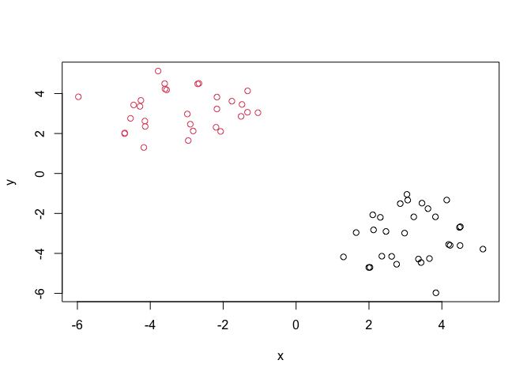
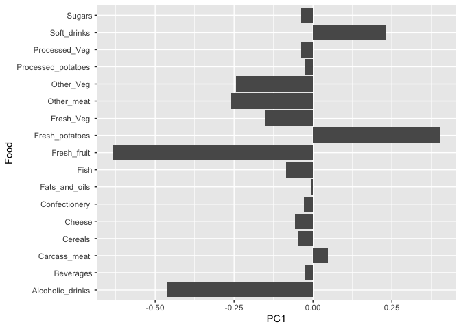

# Class 7: Machine learning 2
Assael Madrigal (PID: A10179083)

\#Clustering k-means clusterine is very prevalent. k means that we need
to tell a k - how many groups I want, later we can tell it what it
should be after analysing the output but we have to start with
something.

To get started let’s make some data, lets see how rnorm works by
plotting a histogram

``` r
#rnorm generates as many random numbers as I ask drawn from a normal distribution

hist(rnorm(10000, mean=3))
```


``` r
#so the mean is where the middle of the histogram is going to be
```

here we are going to make 2 groupings one centered around 3 and the
other at -30

``` r
tmp <- c(rnorm(30, mean=3), rnorm(30,-3))
x <- cbind(x=tmp, y=rev(tmp))
x
```

                  x         y
     [1,]  3.836522 -5.972573
     [2,]  3.618707 -1.761465
     [3,]  2.353646 -4.139926
     [4,]  2.311534 -2.196220
     [5,]  3.429093 -4.456362
     [6,]  4.507342 -2.664922
     [7,]  1.300096 -4.176354
     [8,]  3.658994 -4.257665
     [9,]  2.977294 -2.983296
    [10,]  2.027455 -4.699750
    [11,]  4.227126 -3.595931
    [12,]  4.498311 -3.604932
    [13,]  2.758567 -4.542211
    [14,]  3.356991 -4.283674
    [15,]  2.858156 -1.508527
    [16,]  5.127179 -3.785033
    [17,]  2.466587 -2.901990
    [18,]  4.133562 -1.329631
    [19,]  4.483350 -2.699683
    [20,]  4.186119 -3.552270
    [21,]  3.823909 -2.170651
    [22,]  2.103733 -2.069956
    [23,]  3.454745 -1.483869
    [24,]  3.041381 -1.045924
    [25,]  3.229267 -2.171576
    [26,]  2.126030 -2.822958
    [27,]  2.622623 -4.148987
    [28,]  3.063396 -1.333183
    [29,]  1.994591 -4.704347
    [30,]  1.647966 -2.958582
    [31,] -2.958582  1.647966
    [32,] -4.704347  1.994591
    [33,] -1.333183  3.063396
    [34,] -4.148987  2.622623
    [35,] -2.822958  2.126030
    [36,] -2.171576  3.229267
    [37,] -1.045924  3.041381
    [38,] -1.483869  3.454745
    [39,] -2.069956  2.103733
    [40,] -2.170651  3.823909
    [41,] -3.552270  4.186119
    [42,] -2.699683  4.483350
    [43,] -1.329631  4.133562
    [44,] -2.901990  2.466587
    [45,] -3.785033  5.127179
    [46,] -1.508527  2.858156
    [47,] -4.283674  3.356991
    [48,] -4.542211  2.758567
    [49,] -3.604932  4.498311
    [50,] -3.595931  4.227126
    [51,] -4.699750  2.027455
    [52,] -2.983296  2.977294
    [53,] -4.257665  3.658994
    [54,] -4.176354  1.300096
    [55,] -2.664922  4.507342
    [56,] -4.456362  3.429093
    [57,] -2.196220  2.311534
    [58,] -4.139926  2.353646
    [59,] -1.761465  3.618707
    [60,] -5.972573  3.836522

``` r
plot(x)
```


The main function in R for K-means clustering is called `kmeans()`,
kmeans(x, centers,…). The center is the number of clusters. nstart is
the number of iterations kmeans will go, so one way is to keep
increasing it until the answer does not change or! even better you can
plot the “scree plot” and look at the elbow.

But it is still a limitation, but the advantage is that kmeans is very
fast.

``` r
k <- kmeans(x,centers=2, nstart = 20)
k
```

    K-means clustering with 2 clusters of sizes 30, 30

    Cluster means:
              x         y
    1  3.174142 -3.134082
    2 -3.134082  3.174142

    Clustering vector:
     [1] 1 1 1 1 1 1 1 1 1 1 1 1 1 1 1 1 1 1 1 1 1 1 1 1 1 1 1 1 1 1 2 2 2 2 2 2 2 2
    [39] 2 2 2 2 2 2 2 2 2 2 2 2 2 2 2 2 2 2 2 2 2 2

    Within cluster sum of squares by cluster:
    [1] 72.98158 72.98158
     (between_SS / total_SS =  89.1 %)

    Available components:

    [1] "cluster"      "centers"      "totss"        "withinss"     "tot.withinss"
    [6] "betweenss"    "size"         "iter"         "ifault"      

> Q1. How many points do I need to cluster? (from k)

``` r
k$size
```

    [1] 30 30

``` r
#a vector with the sizes of each cluster
```

> Q2. The clustering result ie membership vector?

``` r
k$cluster
```

     [1] 1 1 1 1 1 1 1 1 1 1 1 1 1 1 1 1 1 1 1 1 1 1 1 1 1 1 1 1 1 1 2 2 2 2 2 2 2 2
    [39] 2 2 2 2 2 2 2 2 2 2 2 2 2 2 2 2 2 2 2 2 2 2

> Q3. Cluster centers?

``` r
k$centers
```

              x         y
    1  3.174142 -3.134082
    2 -3.134082  3.174142

> Q4. Make a plot of our data colored by clustering results with
> optionally the clusters centers shown

``` r
#col is color but if we give it an number it has a color assigned to it, so for this case we can use it to color by the cluster if got assigned to
plot(x, col=k$cluster, pch=16)
points(k$centers, col="blue", pch=15, cex=2)
```


> Q.5 Run kmeans again but cluster into 3 groups and plot the results

``` r
k3 <- kmeans(x,centers=3, nstart = 20)
plot(x, col=k3$cluster, pch=16)
points(k3$centers, col="blue", pch=15, cex=2)
```


The main problem with kmeans is that it will fit the data into the
structure, so if we give it 3 clusters it will split it into 3 clusters.
So on, so we have to be careful.

kmeans: - breaks observations into k-predefined number of clusters - you
define the number of clusters! - help by plotting with scree plots

# Heirarchical clustering

Heirarchical clustering has the advantage that it can potentially reveal
structure in the data rather than imposing one as k-means will.

The main function in “base R” is `hclust()`, is follows
`hclust(d, method = "complete", members = NULL)` where ‘d’ was produced
by `dist()` or any measure of dissimilarity.

It requires a distance matrix as input, not the raw data itself

``` r
d<-dist(x)
hc <- hclust(d)
hc
```


    Call:
    hclust(d = d)

    Cluster method   : complete 
    Distance         : euclidean 
    Number of objects: 60 

``` r
plot(hc)
```


The crossbar height is how far apart the datapoints are. So in this case
the largest difference is in the first 2 clusters and then the smaller
clusters are very little apart from there. Y axis, height, is the
distance of the two branches below it.

There are two forms of hclust: bottom up vs top down

The function to get our clusters/groups from a hclust object is called
`cutree()`

``` r
cutree(hc, k=2)
```

     [1] 1 1 1 1 1 1 1 1 1 1 1 1 1 1 1 1 1 1 1 1 1 1 1 1 1 1 1 1 1 1 2 2 2 2 2 2 2 2
    [39] 2 2 2 2 2 2 2 2 2 2 2 2 2 2 2 2 2 2 2 2 2 2

``` r
#or
cutree(hc, h=8)
```

     [1] 1 1 1 1 1 1 1 1 1 1 1 1 1 1 1 1 1 1 1 1 1 1 1 1 1 1 1 1 1 1 2 2 2 2 2 2 2 2
    [39] 2 2 2 2 2 2 2 2 2 2 2 2 2 2 2 2 2 2 2 2 2 2

``` r
grps <- cutree(hc, k=2)
```

> Q. plot our hclust results in terms of our data colored by cluster
> membership

``` r
plot(x, col=grps)
```



``` r
plot(x, col=grps, pch=15) #pch is just the shape of the points
```


# Principal Component Analysis (PCA)

# UK food class lab

first import the data

``` r
url <- "https://tinyurl.com/UK-foods"
x <- read.csv(url)
```

# Q1. How many rows and columns are in your new data frame named x? What R functions could you use to answer this questions?

``` r
## Complete the following code to find out how many rows and columns are in x?
str(x)
```

    'data.frame':   17 obs. of  5 variables:
     $ X        : chr  "Cheese" "Carcass_meat " "Other_meat " "Fish" ...
     $ England  : int  105 245 685 147 193 156 720 253 488 198 ...
     $ Wales    : int  103 227 803 160 235 175 874 265 570 203 ...
     $ Scotland : int  103 242 750 122 184 147 566 171 418 220 ...
     $ N.Ireland: int  66 267 586 93 209 139 1033 143 355 187 ...

``` r
dim(x)
```

    [1] 17  5

``` r
head(x)
```

                   X England Wales Scotland N.Ireland
    1         Cheese     105   103      103        66
    2  Carcass_meat      245   227      242       267
    3    Other_meat      685   803      750       586
    4           Fish     147   160      122        93
    5 Fats_and_oils      193   235      184       209
    6         Sugars     156   175      147       139

17 rows (observations) and 5 columns (variables) it is using the names
of the food as a column so we are going to make it a name instead

``` r
rownames(x)
```

     [1] "1"  "2"  "3"  "4"  "5"  "6"  "7"  "8"  "9"  "10" "11" "12" "13" "14" "15"
    [16] "16" "17"

I can change them like this: but this is overwriting x every time,
because it is removing a column every time.

``` r
rownames(x) <- x[,1]
x <- x[,-1]
head(x)
```

                   England Wales Scotland N.Ireland
    Cheese             105   103      103        66
    Carcass_meat       245   227      242       267
    Other_meat         685   803      750       586
    Fish               147   160      122        93
    Fats_and_oils      193   235      184       209
    Sugars             156   175      147       139

a better way to do this is: when we read the data we can tell it that
the row names is in column 1 `row.names=1`

``` r
url <- "https://tinyurl.com/UK-foods"
x <- read.csv(url, row.names = 1)
head(x)
```

                   England Wales Scotland N.Ireland
    Cheese             105   103      103        66
    Carcass_meat       245   227      242       267
    Other_meat         685   803      750       586
    Fish               147   160      122        93
    Fats_and_oils      193   235      184       209
    Sugars             156   175      147       139

# Q2. Which approach to solving the ‘row-names problem’ mentioned above do you prefer and why? Is one approach more robust than another under certain circumstances?

I prefer assigning the row names at the same time as reading the data
in. The problem may be if there are no rownames, but I would get the
data first then visualize with with `head()` and then decide which
column to pick for rownames

# Q3: Changing what optional argument in the above barplot() function results in the following plot? ()

I just set beside to False

``` r
barplot(as.matrix(x), beside=F,col=rainbow(nrow(x)))
```


Q5: Generating all pairwise plots may help somewhat. Can you make sense
of the following code and resulting figure? What does it mean if a given
point lies on the diagonal for a given plot?

So the diagonal means they consume the same amount for that particular
food. Deviation from the diagonal is what is different between them.
Each graph is comparing two countries to each other, but it is mirrored.
The main thing is that the difference is what we are looking for.

``` r
pairs(x, col=rainbow(10), pch=16)
```


\#Q6. What is the main differences between N. Ireland and the other
countries of the UK in terms of this data-set?

Based on the graphs alone it is the food represented by the blue dot,
the orange dot. but it is really hard to tell.

To help me makes sense of this data… The main function for PCA in base R
is called `prcomp()`

It wants the transpose (with the `t()`) of our food data for analysis

``` r
pca <- prcomp(t(x))

summary(pca)
```

    Importance of components:
                                PC1      PC2      PC3       PC4
    Standard deviation     324.1502 212.7478 73.87622 3.176e-14
    Proportion of Variance   0.6744   0.2905  0.03503 0.000e+00
    Cumulative Proportion    0.6744   0.9650  1.00000 1.000e+00

The proportion of variance is what i am looking at: 0.67 for PC1 it
means that PC1 is responsible for 67% of the variance. The cumulative
variance is the sum of them so for PC1 and PC2 it is 96.5%

One of the main results that folks look for is called the “score plot”
a.k.a. PC plot, PC1 vs PC2 plot…

We are loooking at the distance from the point to the 0,0

``` r
plot(pca$x[,1], pca$x[,2])
abline(h=0, v=0, col="gray", lty=2) #adding a line just to see where0,0 is
```


# Q7. Complete the code below to generate a plot of PC1 vs PC2. The second line adds text labels over the data points.

``` r
# Plot PC1 vs PC2
plot(pca$x[,1], pca$x[,2], xlab="PC1", ylab="PC2", xlim=c(-270,500))
text(pca$x[,1], pca$x[,2], colnames(x))
```


\#Q8. Customize your plot so that the colors of the country names match
the colors in our UK and Ireland map and table at start of this
document.

``` r
# Plot PC1 vs PC2
plot(pca$x[,1], pca$x[,2], xlab="PC1", ylab="PC2", xlim=c(-270,500))
text(pca$x[,1], pca$x[,2], colnames(x), col=c("orange","red","blue","green"))
```


``` r
v <- round( pca$sdev^2/sum(pca$sdev^2) * 100 )
v
```

    [1] 67 29  4  0

``` r
## or the second row here...
z <- summary(pca)
z$importance
```

                                 PC1       PC2      PC3          PC4
    Standard deviation     324.15019 212.74780 73.87622 3.175833e-14
    Proportion of Variance   0.67444   0.29052  0.03503 0.000000e+00
    Cumulative Proportion    0.67444   0.96497  1.00000 1.000000e+00

``` r
#This information can be summarized in a plot of the variances (eigenvalues) with respect to the principal component number (eigenvector number), which is given below.
barplot(v, xlab="Principal Component", ylab="Percent Variation")
```


To dig deeper we can see how much each variable affects the original
PCA1 from the `$rotation` from `prcomp()` and summarized in `biplot()`

``` r
## Lets focus on PC1 as it accounts for > 90% of variance 
par(mar=c(10, 3, 0.35, 0))
barplot( pca$rotation[,1], las=2 )
```


The two biggest contributors are fresh fruit and soft drinks because
they are the biggest bars.

# Q9: Generate a similar ‘loadings plot’ for PC2. What two food groups feature prominantely and what does PC2 maninly tell us about?

Fresh potatoes makes the countries go left and soft drinks right so
fresh potatoes differ the most between N. Ireland and Soft drinkg makes
it the most different.

``` r
#PC2
par(mar=c(10, 3, 0.35, 0))
barplot( pca$rotation[,2], las=2 )
```


PC2 is predominantly still soft drinks but also alcoholic drinks.

``` r
library(ggplot2)

df <- as.data.frame(pca$x)
df_lab <- tibble::rownames_to_column(df, "Country")

# Our first basic plot
ggplot(df_lab) + 
  aes(PC1, PC2, col=Country) + 
  geom_point()
```


``` r
ggplot(df_lab) + 
  aes(PC1, PC2, col=Country, label=Country) + 
  geom_hline(yintercept = 0, col="gray") +
  geom_vline(xintercept = 0, col="gray") +
  geom_point(show.legend = FALSE) +
  geom_label(hjust=1, nudge_x = -10, show.legend = FALSE) +
  expand_limits(x = c(-300,500)) +
  xlab("PC1 (67.4%)") +
  ylab("PC2 (28%)") +
  theme_bw()
```


we can also make a nice ggplot for our pca

``` r
ld <- as.data.frame(pca$rotation)
ld_lab <- tibble::rownames_to_column(ld, "Food")

ggplot(ld_lab) +
  aes(PC1, Food) +
  geom_col() 
```



and we can also make it nicer to see by color scaling and ordering them
by highest to smallest

``` r
ggplot(ld_lab) +
  aes(PC1, reorder(Food, PC1), bg=PC1) +
  geom_col() + 
  xlab("PC1 Loadings/Contributions") +
  ylab("Food Group") +
  scale_fill_gradient2(low="purple", mid="gray", high="darkgreen", guide=NULL) +
  theme_bw()
```


another way to visualize this is by using a biplot

``` r
## The inbuilt biplot() can be useful for small datasets 
biplot(pca)
```


# PCA for RNA-seq

loading the data

``` r
url2 <- "https://tinyurl.com/expression-CSV"
rna.data <- read.csv(url2, row.names=1)
head(rna.data)
```

           wt1 wt2  wt3  wt4 wt5 ko1 ko2 ko3 ko4 ko5
    gene1  439 458  408  429 420  90  88  86  90  93
    gene2  219 200  204  210 187 427 423 434 433 426
    gene3 1006 989 1030 1017 973 252 237 238 226 210
    gene4  783 792  829  856 760 849 856 835 885 894
    gene5  181 249  204  244 225 277 305 272 270 279
    gene6  460 502  491  491 493 612 594 577 618 638

Q10: How many genes and samples are in this data set?

``` r
class(rna.data)
```

    [1] "data.frame"

``` r
str(rna.data)
```

    'data.frame':   100 obs. of  10 variables:
     $ wt1: int  439 219 1006 783 181 460 27 175 658 121 ...
     $ wt2: int  458 200 989 792 249 502 30 182 669 116 ...
     $ wt3: int  408 204 1030 829 204 491 37 184 653 134 ...
     $ wt4: int  429 210 1017 856 244 491 29 166 633 117 ...
     $ wt5: int  420 187 973 760 225 493 34 180 657 133 ...
     $ ko1: int  90 427 252 849 277 612 304 255 628 931 ...
     $ ko2: int  88 423 237 856 305 594 304 291 627 941 ...
     $ ko3: int  86 434 238 835 272 577 285 305 603 990 ...
     $ ko4: int  90 433 226 885 270 618 311 271 635 982 ...
     $ ko5: int  93 426 210 894 279 638 285 269 620 934 ...

``` r
dim(rna.data)
```

    [1] 100  10

There are 100 genes and 10 samples (columns)
